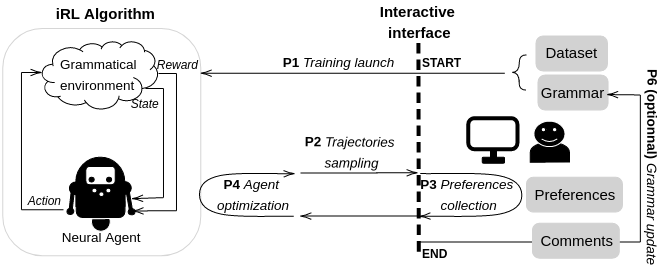

# Interactive Reinforcement Learning for Symbolic Regression from Multi-Format Human-Preference Feedbacks

by 
Laure Crochepierre, 
Lydia Boudjeloud-Assala, 
Vincent Barbesant 

This paper has been presented in the Demo Track during the IJCAI-ECAI conference in 2022. 
See the paper here <https://www.ijcai.org/proceedings/2022/849>

*Interactive Reinforcement Learning algorithm.*

## Abstract

> In this work, we propose an interactive platform to perform grammar-guided symbolic regression using a reinforcement learning approach from human-preference feedback. To do so, a reinforcement learning algorithm iteratively generates symbolic expressions, modeled as trajectories constrained by grammatical rules, from which a user shall elicit preferences. The interface gives the user three distinct ways of stating its preferences between multiple sampled symbolic expressions: categorizing samples, comparing pairs, and suggesting improvements to a sampled symbolic expression. Learning from preferences enables users to guide the exploration in the symbolic space toward regions that are more relevant to them. We provide a web-based interface testable on symbolic regression benchmark functions and power system data. 

## Software implementation

All source code used to generate the web app and the demo of the paper are in
the `src` folder.
The grammar structures are all defined inside the `grammar` folder.
The data used for the demo is provided in `data`. For the power system use case, we provide the  
Results generated by the code are saved in `results`.

## Getting the code

You can download a copy of all the files in this repository by cloning the
[git](https://git-scm.com/) repository:

    git clone https://github.com/laure-crochepierre/interactive-rbg2sr.git

## Dependencies

You'll need a working Python environment to run the code. 3.8 is currently supported.
The recommended way to set up your environment is through the use of `pip` and `virtualenv`.
A virtual environment can be created in your user directory and does not interfere with
the system Python installation.

The required dependencies are specified in the file `requirement.txt`.

We use `pip` to manage the project dependencies in
isolation.
Thus, you can install our dependencies without causing conflicts with your
setup (even with different Python versions).

Run the following command in the repository folder (where `requirement.txt`
is located) to create a separate environment and install all required
dependencies in it:

    python3 -m venv /path/to/new/virtual/ENVIRONMENT_NAME

    source /path/to/new/virtual/ENVIRONMENT_NAME/bin/activate

    pip install -f requirement.txt

## Power system data generation 
To generate data for the power system applied used case, use the generation script, where you can optionally add a p
parameter DC (for *Direct Current*) or AC (for *Alternative Current*)

    python src/generate_n_dataset.py AC
    python src/generate_n_dataset.py DC

then move the created dataset to the `data` folder in a newly created folder with the `case_14`. 

## Launching the application

Before running any code you must activate the environment:

    source  /path/to/new/virtual/ENVIRONMENT_NAME/bin/activate

This will enable the environment for your current terminal session.
Any subsequent commands will use software that is installed in the environment.

You must then enter the `src` folder, for example with Linux :

    cd interactive-rbg2sr-root/src 

To launch the app, run this in the top `src` folder of the repository:

    python app.py

If all goes well, the app is launched locally in your internet browser, such as `http://127.0.0.1:8050/`.

From this app, you can then test our Symbolic Regression scenarios. An online version of the app is also available at `https://interactive-rbg2sr.herokuapp.com/`

**Warning** Because we using a free Heroku setup, the online server on the Heroku website can only handle one user at 
the time. The online server might have crashed if too many people are using the app simultaneously.

## License

All source code is made available under a MPL-2.0 license.

## Citation

    @inproceedings{ijcai2022-849,
      title     = {Interactive Reinforcement Learning for Symbolic Regression from Multi-Format Human-Preference Feedbacks},
      author    = {Crochepierre, Laure and Boudjeloud-Assala, Lydia and Barbesant, Vincent},
      booktitle = {Proceedings of the Thirty-First International Joint Conference on
                   Artificial Intelligence, {IJCAI-22}},
      publisher = {International Joint Conferences on Artificial Intelligence Organization},
      editor    = {Lud De Raedt},
      pages     = {5900--5903},
      year      = {2022},
      month     = {7},
      note      = {Demo Track}
      doi       = {10.24963/ijcai.2022/849},
      url       = {https://doi.org/10.24963/ijcai.2022/849},
    }

## Contact 
*laure.crochepierre@rte-france.com* , 
*laure.crochepierre@univ-lorraine.fr*